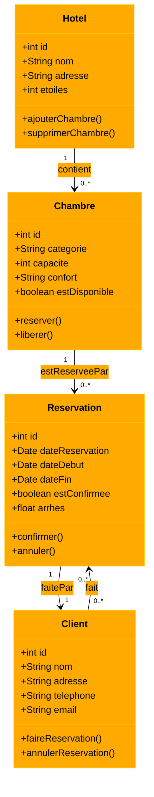

Diagramme use case fait sur plantUML :
```
@startuml
left to right direction

actor Client
actor Réceptionniste
actor Directeur

usecase "Réserver une chambre" as UC1
usecase "Enregistrement" as UC2
usecase "Départ" as UC3
usecase "Gérer les réservations" as UC4

Client --> UC1 : Réserve une chambre en ligne
Réceptionniste --> UC2 : Enregistre le client
Réceptionniste --> UC3 : Fait le départ du client
Directeur --> UC4 : Gère toutes les réservations

@enduml
```


Diagramme de classe : 



Diagramme d'activité du processus de réservation : 

```mermaid
%%{init: {'theme': 'base', 'themeVariables': { 'fontSize': '16px', 'primaryColor': '#ffaa00', 'primaryBorderColor': '#ffcc00', 'primaryTextColor': '#000000', 'lineColor': '#000000', 'secondaryColor': '#ffdd66', 'tertiaryColor': '#ffee99'}}}%%
---
title: Diagramme d'activité
---
flowchart TD
    A[Début] --> B[Remplir le formulaire de réservation]
    B --> C{Vérifier la disponibilité}
    C -->|Disponible| D[Créer la réservation]
    C -->|Non disponible| E[Notifier le client]
    D --> F[Payer les arrhes]
    F --> G[Confirmer la réservation]
    G --> H[Fin]
    E --> H
```
